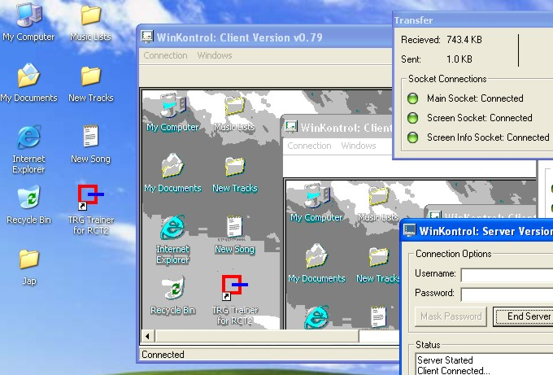



## WinKontrol v0\.7

### Description

The code consists of two programs which act as a server and a client. When connected, the client program can then 'control' the machine running the server. Screenshots are sent from the server to the client. Client can send mouse movement and clicks, and keyboard keys.
 
### More Info
 
Screenshots are sent from the server to the client. Client can send mouse movement and clicks, and keyboard keys.

If you can think of ANYTHING to help me make this better, please let me know. Please leave your comments and please vote for me.

Still in BETA Version: May crash.

Also, can be tested on same machine. But may run out of memory after a while on older machines.

             |
---                |---
**Submitted On**   |2003-04-22 10:03:56
**By**             |[5aTaN Si](https://github.com/Planet-Source-Code/PSCIndex/blob/master/ByAuthor/5atan-si.md)
**Level**          |Intermediate
**User Rating**    |4.5 (18 globes from 4 users)
**Compatibility**  |VB 6\.0
**Category**       |[Internet/ HTML](https://github.com/Planet-Source-Code/PSCIndex/blob/master/ByCategory/internet-html__1-34.md)
**World**          |[Visual Basic](https://github.com/Planet-Source-Code/PSCIndex/blob/master/ByWorld/visual-basic.md)
**Archive File**   |[WinKontrol1577754222003\.zip](https://github.com/Planet-Source-Code/5atan-si-winkontrol-v0-7__1-44945/archive/master.zip)

